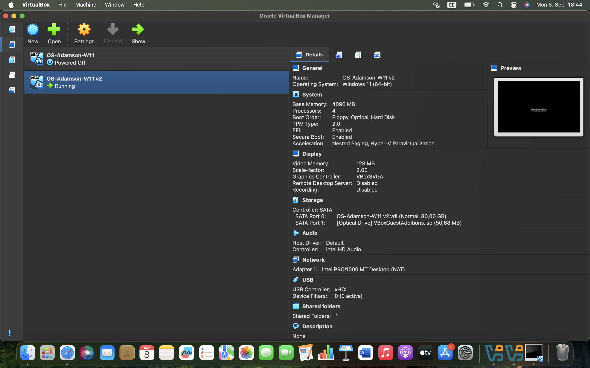
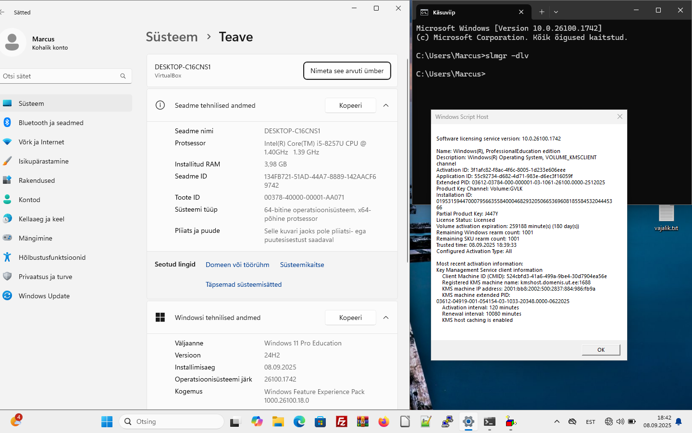

# Praktikum 1 aruanne

**Kursus:** Operatsioonisüsteemid  
**Praktikumi number:** 1  
**Töö tegemise aeg:** Ligikaudu 4 

See oli esimene praktikum operatsioonisüsteemis, kus pidi paigaldama VirtualBox ja sinna omakorda Windows.

Praktikumi käigus tegin järgnevad sammud:

1. Paigaldasin oma sülearvutisse VirtualBoxi tarkvara.  
2. Lõin uue virtuaalmasina ja installisin sinna Windows 11 operatsioonisüsteemi.  
3. Kohandasin ja seadistasin Windows 11 vastavalt juhistele ja laadisin alla ka vaja olevad failid.
4. Pidin tegema VM-i kaks korda, kuna esimene kord ei tulnud välja.

**Puutusin kokku selle praktikumi ajal järgmiste probleemidega:**
1) Bitlocker recovery key
2) VPN-i seadistamine

Allpool on minu tehtud töö tõestus:

### Virtuaalmasina seadistus
  
*Ekraanipilt VirtualBoxi seadistustest ja Windows 11 installeerimisest.*

### Windows 11 kohandamine
  
*Ekraanipilt Windows 11 kohandatud keskkonnast pärast praktikumit.*

---

**Isiklik kommentaar:**  
Praktikum oli alguses keeruline, kuid samal ajal väga õpetlik. Virtuaalmasina loomine ja Windows 11 seadistamine aitasid mõista operatsioonisüsteemi toimimist ja keskkonna kohandamise põhimõtteid. Olen rahul, et lõpuks kõik õnnestus ja sain vajalikud teadmised kätte.
